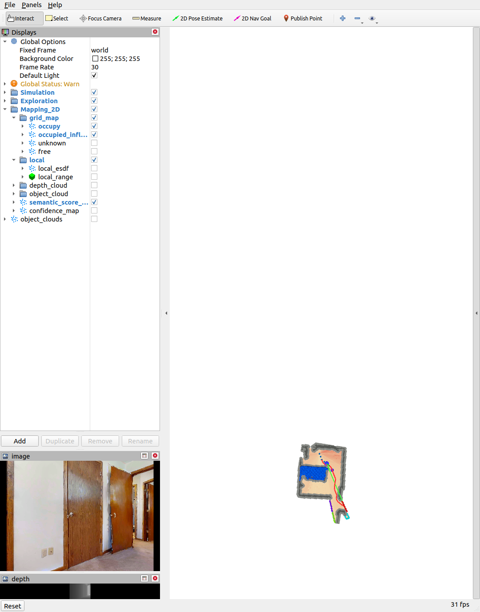
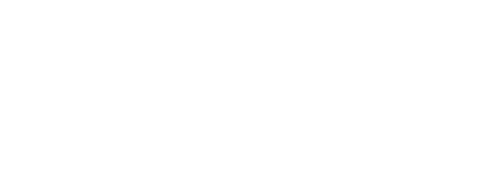
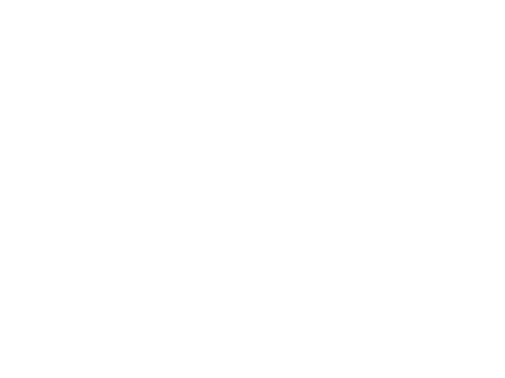
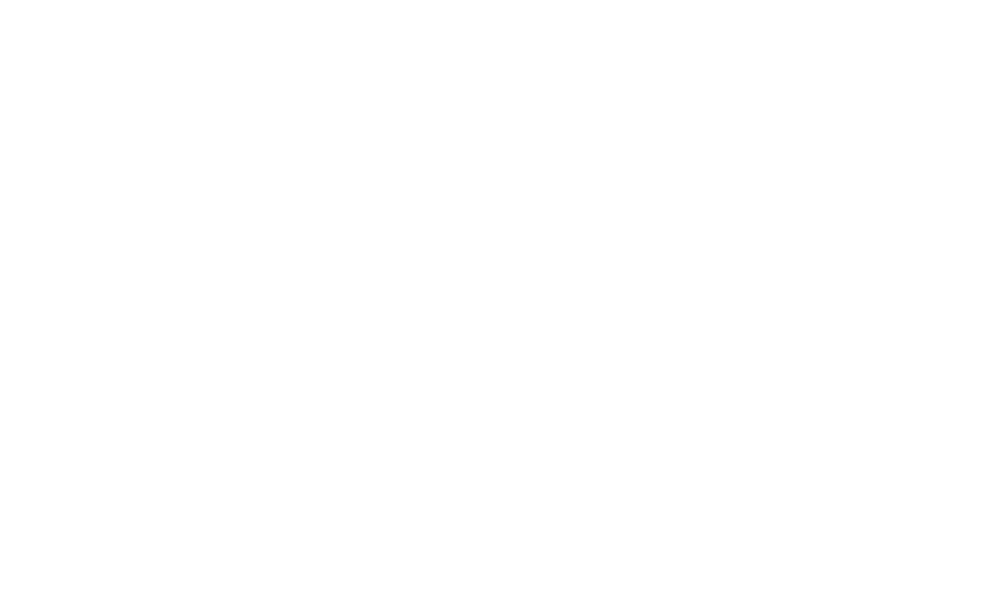

<div align="center">
    
    <h2>An Adaptive Exploration Strategy for Zero-Shot Object Navigation with Target-centric Semantic Fusion</h2>
    <strong>
      <em>IEEE Robotics and Automation Letters</em>
    </strong>
    <br>
        <a href="https://zager-zhang.github.io" target="_blank">Mingjie Zhang</a><sup>1, 2</sup>,
        Yuheng Du<sup>1</sup>,
        <a href="https://chengkaiwu.me" target="_blank">Chengkai Wu</a><sup>1</sup>,
        Jinni Zhou<sup>1</sup>,
        Zhenchao Qi<sup>1</sup>,
        <a href="https://personal.hkust-gz.edu.cn/junma/people-page.html" target="_blank">Jun Ma</a><sup>1</sup>,
        <a href="https://robotics-star.com/people" target="_blank">Boyu Zhou</a><sup>2,†</sup>
        <p>
        <h45>
            <sup>1</sup> The Hong Kong University of Science and Technology (Guangzhou). &nbsp;&nbsp;
            <br>
            <sup>2</sup> Southern University of Science and Technology. &nbsp;&nbsp;
            <br>
        </h45>
        <sup>†</sup>Corresponding Authors
    </p>
    <a href="https://ieeexplore.ieee.org/document/11150727"></a>
    <a href="https://arxiv.org/abs/2504.14478"></a>
    <a href='https://robotics-star.com/ApexNav'></a>

<br>
<br>

<p align="center" style="font-size: 1.0em;">
  <a href="">
    
  </a>
  <br>
  <em>
    ApexNav ensures highly <strong>reliable</strong> object navigation by leveraging <strong>Target-centric Semantic Fusion</strong>, and boosts <strong>efficiency</strong> with its <strong>Adaptive Exploration Strategy</strong>.
  </em>
</p>

</div>

## 📢 News
- **[10/02/2026]**: ROS2 Jazzy support is now available! Thanks to [romaster93](https://github.com/romaster93) for contributing the ROS2 interface. Check out the [ros2-jazzy](https://github.com/Robotics-STAR-Lab/ApexNav/tree/ros2-jazzy) branch.
- **[10/12/2025]**: ApexNav released real world test example code. Check out the [Real World README](./real_world_test_example/README.md) for more details.
- **[07/09/2025]**: ApexNav has been published in the Early Access area on [IEEE Xplore](https://ieeexplore.ieee.org/document/11150727).
- **[22/08/2025]**: Release the main algorithm of ApexNav.
- **[18/08/2025]**: ApexNav is conditionally accepted to RA-L 2025.

## 📜 Introduction

**[RA-L'25]** This repository maintains the implementation of "ApexNav: An Adaptive Exploration Strategy for Zero-Shot Object Navigation with Target-centric Semantic Fusion".

The pipeline of ApexNav is detailed in the overview below.

<p align="center" style="font-size: 1.0em;">
  <a href="">
    
  </a>
</p>
Please kindly star ⭐ this project if it helps you. Thanks for your support! 💖

## 🛠️ Installation
> Tested on Ubuntu 20.04 with ROS Noetic and Python 3.9

You need to install [ROS](https://www.ros.org/), and it is recommended to use [Anaconda](https://www.anaconda.com/) or [Miniconda](https://docs.conda.io/en/latest/miniconda.html) to manage your Python environment.

### 1. Prerequisites

#### 1.1 System Dependencies
``` bash
sudo apt update
sudo apt-get install libarmadillo-dev libompl-dev
```

#### 1.2 LLM (Optional)
> You can skip LLM configuration and directly use our pre-generated LLM output results in `llm/answers`.

ollama 
``` bash
curl -fsSL https://ollama.com/install.sh | sh
ollama pull qwen3:8b
```

#### 1.3 External Code Dependencies
```bash
git clone git@github.com:WongKinYiu/yolov7.git # yolov7
git clone https://github.com/IDEA-Research/GroundingDINO.git # GroundingDINO
```

#### 1.4 Model Weights Download

Download the following model weights and place them in the `data/` directory:
- `mobile_sam.pt`: https://github.com/ChaoningZhang/MobileSAM/tree/master/weights/mobile_sam.pt
- `groundingdino_swint_ogc.pth`: 
  ```bash
  wget -O data/groundingdino_swint_ogc.pth https://github.com/IDEA-Research/GroundingDINO/releases/download/v0.1.0-alpha/groundingdino_swint_ogc.pth
  ```
- `yolov7-e6e.pt`: 
  ```bash
  wget -O data/yolov7-e6e.pt https://github.com/WongKinYiu/yolov7/releases/download/v0.1/yolov7-e6e.pt
  ```


### 2. Setup Python Environment

#### 2.1 Clone Repository
``` bash
git clone git@github.com:Robotics-STAR-Lab/ApexNav.git
cd ApexNav
```

#### 2.2 Create Conda Environment
``` bash
conda env create -f apexnav_environment.yaml -y
conda activate apexnav
```

#### 2.3 Pytorch
``` bash
# You can use 'nvcc --version' to check your CUDA version.
# CUDA 11.8
pip install torch==2.5.0 torchvision==0.20.0 torchaudio==2.5.0 --index-url https://download.pytorch.org/whl/cu118
# CUDA 12.1
pip install torch==2.5.0 torchvision==0.20.0 torchaudio==2.5.0 --index-url https://download.pytorch.org/whl/cu121
# CUDA 12.4
pip install torch==2.5.0 torchvision==0.20.0 torchaudio==2.5.0 --index-url https://download.pytorch.org/whl/cu124
```

#### 2.4 Habitat Simulator
> We recommend using habitat-lab v0.3.1
``` bash
# habitat-lab v0.3.1
git clone https://github.com/facebookresearch/habitat-lab.git
cd habitat-lab; git checkout tags/v0.3.1;
pip install -e habitat-lab

# habitat-baselines v0.3.1
pip install -e habitat-baselines
```

**Note:** Any numpy-related errors will not affect subsequent operations, as long as `numpy==1.23.5` and `numba==0.60.0` are correctly installed.

#### 2.5 Others
``` bash
pip install salesforce-lavis==1.0.2 # -i https://pypi.tuna.tsinghua.edu.cn/simple
cd .. # Return to ApexNav directory
pip install -e .
```

**Note:** Any numpy-related errors will not affect subsequent operations, as long as `numpy==1.23.5` and `numba==0.60.0` are correctly installed.

## 📥 Datasets Download
> Official Reference: https://github.com/facebookresearch/habitat-lab/blob/main/DATASETS.md

### 🏠 Scene Datasets
**Note:** Both HM3D and MP3D scene datasets require applying for official permission first. You can refer to my commands below, and if you encounter any issues, please refer to the official documentation at https://github.com/facebookresearch/habitat-lab/blob/main/DATASETS.md.

#### HM3D Scene Dataset
1. Apply for permission at https://matterport.com/habitat-matterport-3d-research-dataset.
2. Download https://api.matterport.com/resources/habitat/hm3d-val-habitat-v0.2.tar.
3. Save `hm3d-val-habitat-v0.2.tar` to the `ApexNav/` directory, and the following commands will help you extract and place it in the correct location:
``` bash
mkdir -p data/scene_datasets/hm3d/val
mv hm3d-val-habitat-v0.2.tar data/scene_datasets/hm3d/val/
cd data/scene_datasets/hm3d/val
tar -xvf hm3d-val-habitat-v0.2.tar
rm hm3d-val-habitat-v0.2.tar
cd ../..
ln -s hm3d hm3d_v0.2 # Create a symbolic link for hm3d_v0.2
```

#### MP3D Scene Dataset
1. Apply for download access at https://niessner.github.io/Matterport/.
2. After successful application, you will receive a `download_mp.py` script, which should be run with `python2.7` to download the dataset.
3. After downloading, place the files in `ApexNav/data/scene_datasets`.

### 🎯 Task Datasets
``` bash
# Create necessary directory structure
mkdir -p data/datasets/objectnav/hm3d
mkdir -p data/datasets/objectnav/mp3d

# HM3D-v0.1
wget -O data/datasets/objectnav/hm3d/v1.zip https://dl.fbaipublicfiles.com/habitat/data/datasets/objectnav/hm3d/v1/objectnav_hm3d_v1.zip
unzip data/datasets/objectnav/hm3d/v1.zip -d data/datasets/objectnav/hm3d && mv data/datasets/objectnav/hm3d/objectnav_hm3d_v1 data/datasets/objectnav/hm3d/v1 && rm data/datasets/objectnav/hm3d/v1.zip

# HM3D-v0.2
wget -O data/datasets/objectnav/hm3d/v2.zip https://dl.fbaipublicfiles.com/habitat/data/datasets/objectnav/hm3d/v2/objectnav_hm3d_v2.zip
unzip data/datasets/objectnav/hm3d/v2.zip -d data/datasets/objectnav/hm3d && mv data/datasets/objectnav/hm3d/objectnav_hm3d_v2 data/datasets/objectnav/hm3d/v2 && rm data/datasets/objectnav/hm3d/v2.zip

# MP3D
wget -O data/datasets/objectnav/mp3d/v1.zip https://dl.fbaipublicfiles.com/habitat/data/datasets/objectnav/m3d/v1/objectnav_mp3d_v1.zip
unzip data/datasets/objectnav/mp3d/v1.zip -d data/datasets/objectnav/mp3d/v1 && rm data/datasets/objectnav/mp3d/v1.zip
```

<details>
<summary>Make sure that the folder `data` structure has the following structure:</summary>

```
data
├── datasets
│   └── objectnav
│       ├── hm3d
│       │   ├── v1
│       │   │   ├── train
│       │   │   ├── val
│       │   │   └── val_mini
│       │   └── v2
│       │       ├── train
│       │       ├── val
│       │       └── val_mini
│       └── mp3d
│           └── v1
│               ├── train
│               ├── val
│               └── val_mini
├── scene_datasets
│   ├── hm3d
│   │   └── val
│   │       ├── 00800-TEEsavR23oF
│   │       ├── 00801-HaxA7YrQdEC
│   │       ├── .....
│   ├── hm3d_v0.2 -> hm3d
│   └── mp3d
│       ├── 17DRP5sb8fy
│       ├── 1LXtFkjw3qL
│       ├── .....
├── groundingdino_swint_ogc.pth
├── mobile_sam.pt
└── yolov7-e6e.pt
```

Note that `train` and `val_mini` are not required and you can choose to delete them.
</details>

## 🚀 Usage
> All following commands should be run in the `apexnav` conda environment
### ROS Compilation
``` bash
catkin_make -DPYTHON_EXECUTABLE=/usr/bin/python3
```
### Minimal Verified Reproduction on HM3D-v2

This repository can be run in a lightweight but complete `ObjectNav` loop on **Ubuntu 20.04 + ROS Noetic + Habitat + HM3D-v2**. The following setup was validated for reproducing a **single HM3D-v2 episode** with:

- 4 independent VLM servers
- 1 RViz visualization terminal
- 1 ApexNav planner terminal
- 1 Habitat evaluation terminal

This gives a full end-to-end path from **target category -> VLM perception -> semantic map fusion -> exploration/planning -> Habitat action execution**.

#### What each terminal does

| Terminal | Process | Role in the pipeline |
| --- | --- | --- |
| 1 | GroundingDINO | Open-vocabulary target grounding conditioned on text prompts |
| 2 | BLIP2 ITM | Image-text matching for target-region verification |
| 3 | MobileSAM | Pixel-level segmentation refinement for candidate regions |
| 4 | YOLOv7 | Fast closed-set object detection for common categories |
| 5 | RViz | Visualizes maps, frontiers, trajectories, and planner state |
| 6 | `exploration.launch` | Main ROS navigation / semantic exploration stack |
| 7 | `habitat_evaluation.py` | Loads HM3D-v2 episodes, publishes Habitat observations, receives navigation actions |

#### Common environment bootstrap

Run the following prefix in every terminal before the command itself:

```bash
cd /path/to/ApexNav
source /opt/ros/noetic/setup.bash
source "$(conda info --base)/etc/profile.d/conda.sh"
conda activate apexnav
```

If you want to reproduce the same CPU-only setup used below, keep `CUDA_VISIBLE_DEVICES=""` in the VLM terminals. Remove it if you want GPU inference.

#### Terminal 1: GroundingDINO

```bash
cd /path/to/ApexNav && \
source /opt/ros/noetic/setup.bash && \
source "$(conda info --base)/etc/profile.d/conda.sh" && \
conda activate apexnav && \
CUDA_VISIBLE_DEVICES="" python -m vlm.detector.grounding_dino --port 12181
```

#### Terminal 2: BLIP2 ITM

```bash
cd /path/to/ApexNav && \
source /opt/ros/noetic/setup.bash && \
source "$(conda info --base)/etc/profile.d/conda.sh" && \
conda activate apexnav && \
CUDA_VISIBLE_DEVICES="" python -m vlm.itm.blip2itm --port 12182
```

#### Terminal 3: MobileSAM

```bash
cd /path/to/ApexNav && \
source /opt/ros/noetic/setup.bash && \
source "$(conda info --base)/etc/profile.d/conda.sh" && \
conda activate apexnav && \
CUDA_VISIBLE_DEVICES="" python -m vlm.segmentor.sam --port 12183
```

#### Terminal 4: YOLOv7

```bash
cd /path/to/ApexNav && \
source /opt/ros/noetic/setup.bash && \
source "$(conda info --base)/etc/profile.d/conda.sh" && \
conda activate apexnav && \
CUDA_VISIBLE_DEVICES="" python -m vlm.detector.yolov7 --port 12184
```

#### Terminal 5: RViz visualization

```bash
cd /path/to/ApexNav && \
source /opt/ros/noetic/setup.bash && \
source "$(conda info --base)/etc/profile.d/conda.sh" && \
conda activate apexnav && \
source ./devel/setup.bash && \
roslaunch exploration_manager rviz.launch
```

#### Terminal 6: ApexNav main algorithm

```bash
cd /path/to/ApexNav && \
source /opt/ros/noetic/setup.bash && \
source "$(conda info --base)/etc/profile.d/conda.sh" && \
conda activate apexnav && \
source ./devel/setup.bash && \
roslaunch exploration_manager exploration.launch
```

#### Terminal 7: Run one HM3D-v2 episode

```bash
cd /path/to/ApexNav && \
source /opt/ros/noetic/setup.bash && \
source "$(conda info --base)/etc/profile.d/conda.sh" && \
conda activate apexnav && \
source ./devel/setup.bash && \
unset ALL_PROXY all_proxy HTTP_PROXY http_proxy HTTPS_PROXY https_proxy && \
python habitat_evaluation.py --dataset hm3dv2 test_epi_num=10
```

This command loads **episode 10** from the HM3D-v2 validation set and drives the planner in the Habitat simulator.

If you also want Habitat-side evaluation videos, run:

```bash
cd /path/to/ApexNav && \
source /opt/ros/noetic/setup.bash && \
source "$(conda info --base)/etc/profile.d/conda.sh" && \
conda activate apexnav && \
source ./devel/setup.bash && \
unset ALL_PROXY all_proxy HTTP_PROXY http_proxy HTTPS_PROXY https_proxy && \
python habitat_evaluation.py --dataset hm3dv2 test_epi_num=10 need_video=true
```

#### Expected runtime behavior

- Terminals 1-4 should stay alive and wait for requests on ports `12181-12184`.
- Terminal 5 should open RViz and show the ApexNav visualization layout.
- Terminal 6 should start the planner and wait until Habitat begins publishing odometry and trigger messages.
- Terminal 7 should load the Habitat environment, publish `/habitat/camera_rgb`, `/habitat/camera_depth`, `/habitat/odom`, and `/habitat/sensor_pose`, then receive planner actions from `/habitat/plan_action`.

When everything is wired correctly, you should observe:

- target-conditioned detections from GroundingDINO / YOLOv7
- segmentation masks refined by MobileSAM
- BLIP2 ITM similarity scores for semantic verification
- frontier / semantic map updates in RViz
- planner-generated navigation actions being executed by Habitat

#### End-to-end data flow

```mermaid
flowchart LR
    A[HM3D-v2 episode<br/>scene + target category + start pose] --> B[Habitat simulator]
    B --> C[RGB / Depth / GPS / Compass]
    C --> D[habitat2ros bridge]
    D --> E[ROS topics<br/>/habitat/camera_rgb<br/>/habitat/camera_depth<br/>/habitat/odom<br/>/habitat/sensor_pose]
    E --> F[GroundingDINO]
    E --> G[YOLOv7]
    F --> H[Candidate boxes]
    G --> H
    H --> I[MobileSAM masks]
    H --> J[BLIP2 ITM scores]
    I --> K[Object point clouds + semantic confidence]
    J --> K
    K --> L[plan_env + exploration_manager]
    L --> M[path_searching + trajectory_manager]
    M --> N[/habitat/plan_action]
    N --> B
    L --> O[RViz]
    M --> O
```

#### Visualization

The repository already contains visual artifacts that match the reproduction workflow above:

<p align="center" style="font-size: 1.0em;">
  <a href="">
    
  </a>
  <br>
  <em>Habitat-side object navigation example driven by the full semantic navigation stack.</em>
</p>

<p align="center" style="font-size: 1.0em;">
  <a href="">
    
  </a>
  <br>
  <em>RViz layout used to inspect planner state, maps, and exploration results.</em>
</p>

<p align="center" style="font-size: 1.0em;">
  <a href="">
    
  </a>
  <br>
  <em>A fresh RViz screenshot captured during the local 7-terminal HM3D-v2 reproduction described above.</em>
</p>

<p align="center" style="font-size: 1.0em;">
  <a href="">
    
  </a>
  <br>
  <em>Local Habitat observation window captured from the same HM3D-v2 episode used in the reproduction flow.</em>
</p>

<p align="center" style="font-size: 1.0em;">
  <a href="">
    
  </a>
  <br>
  <em>Detection window captured locally: ApexNav highlighted a semantically related object region and refined it with segmentation.</em>
</p>

<p align="center" style="font-size: 1.0em;">
  <a href="">
    
  </a>
  <br>
  <em>Log summary panel generated from the local reproduction context, including episode, target label, and live pipeline status.</em>
</p>

<p align="center" style="font-size: 1.0em;">
  <a href="">
    
  </a>
  <br>
  <em>Point-to-point navigation interaction in RViz.</em>
</p>

<p align="center" style="font-size: 1.0em;">
  <a href="">
    
  </a>
  <br>
  <em>Autonomous exploration and trajectory execution in the RViz + Habitat loop.</em>
</p>

#### Troubleshooting

- `ModuleNotFoundError: No module named 'plan_env'`
  - You forgot `source ./devel/setup.bash` before running `habitat_evaluation.py` or ROS nodes.
- VLM servers start but the evaluation terminal cannot connect
  - Check that all four servers are still alive on ports `12181-12184`.
- Local requests are unexpectedly routed through a proxy
  - Use `unset ALL_PROXY all_proxy HTTP_PROXY http_proxy HTTPS_PROXY https_proxy` before the evaluation command.
- `UserWarning: Failed to load custom C++ ops. Running on CPU mode Only!`
  - This is expected in CPU-only validation mode and does not prevent the reproduction pipeline from running.

### Run VLM Servers
Each command should be run in a separate terminal.
``` bash
python -m vlm.detector.grounding_dino --port 12181
python -m vlm.itm.blip2itm --port 12182
python -m vlm.segmentor.sam --port 12183
python -m vlm.detector.yolov7 --port 12184
```

### Launch Visualization and Main Algorithm
```bash
source ./devel/setup.bash && roslaunch exploration_manager rviz.launch # RViz visualization
source ./devel/setup.bash && roslaunch exploration_manager exploration.launch # ApexNav main algorithm
```

### Evaluate Datasets in Habitat
You can evaluate on all episodes of a dataset.
```bash
# Need to source the workspace
source ./devel/setup.bash

# Choose one datasets to evaluate
python habitat_evaluation.py --dataset hm3dv1
python habitat_evaluation.py --dataset hm3dv2 # default
python habitat_evaluation.py --dataset mp3d

# You can also evaluate on one specific episode.
python habitat_evaluation.py --dataset hm3dv2 test_epi_num=10 # episode_id 10
```
If you want to generate evaluation videos for each episode (videos will be categorized by task results), you can use the following command:
```bash
python habitat_evaluation.py --dataset hm3dv2 need_video=true
```

### 🎮 Keyboard Control in Habitat
You can also choose to manually control the agent in the Habitat simulator:
```bash
# Need to source the workspace
source ./devel/setup.bash

python habitat_manual_control.py --dataset hm3dv1 # Default episode_id = 0
python habitat_manual_control.py --dataset hm3dv1 test_epi_num=10 # episode_id = 10
```

### 🤖 Real-world Deployment Example
If you want to run the real-world test example inside the Habitat simulator, please refer to the [Real World README](./real_world_test_example/README.md) for more details.

<p align="center" style="font-size: 1.0em;">
  <a href="">
    
  </a>
  <br>
  <em>
    Trajectory Planning and MPC Control in Real-world Deployment Example in Habitat Simulator.
  </em>
</p>

## 📋 TODO List

- [x] Release the main algorithm of ApexNav
- [x] Complete Installation and Usage documentation
- [x] Add datasets download documentation
- [x] Release the code of real-world deployment
- [x] Add ROS2 support


## 📚 Acknowledgment

We would like to acknowledge the contributions of the following projects:
- **[VLFM](https://github.com/bdaiinstitute/vlfm)**: For the concept of Vision-Language Frontier Maps.
- **[FUEL](https://github.com/HKUST-Aerial-Robotics/FUEL)**: For the TSP-based efficient frontier exploration framework.
## ✒️ Citation

```bibtex
@ARTICLE{zhang2025apexnav,
  author={Zhang, Mingjie and Du, Yuheng and Wu, Chengkai and Zhou, Jinni and Qi, Zhenchao and Ma, Jun and Zhou, Boyu},
  journal={IEEE Robotics and Automation Letters}, 
  title={ApexNAV: An Adaptive Exploration Strategy for Zero-Shot Object Navigation With Target-Centric Semantic Fusion}, 
  year={2025},
  volume={10},
  number={11},
  pages={11530-11537},
  keywords={Semantics;Navigation;Training;Robustness;Detectors;Noise measurement;Geometry;Three-dimensional displays;Object recognition;Faces;Search and rescue robots;vision-based navigation;autonomous agents},
  doi={10.1109/LRA.2025.3606388}}
```
